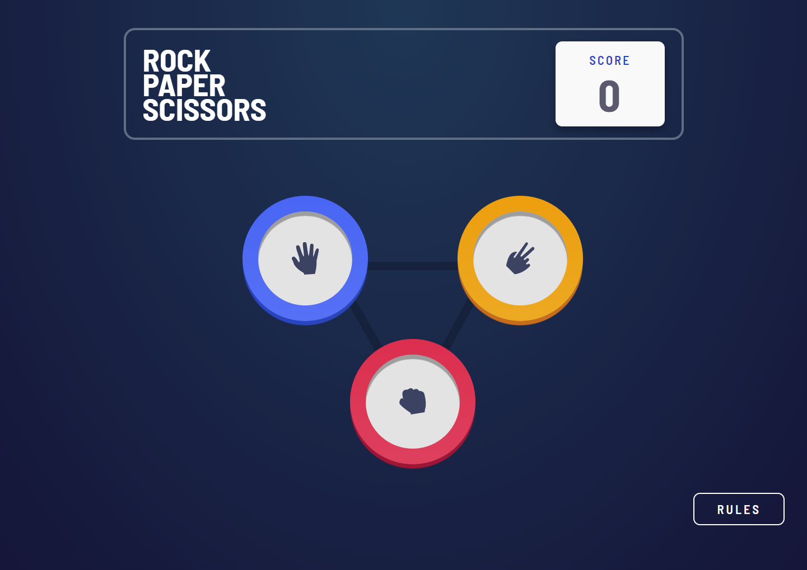
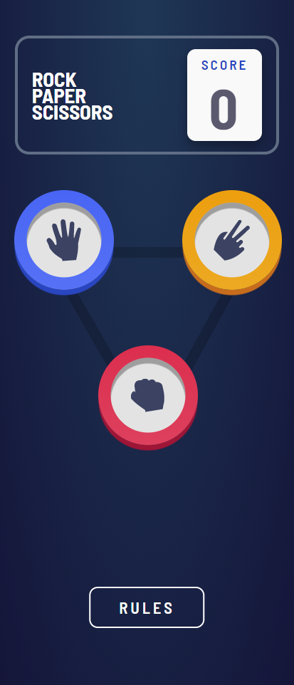
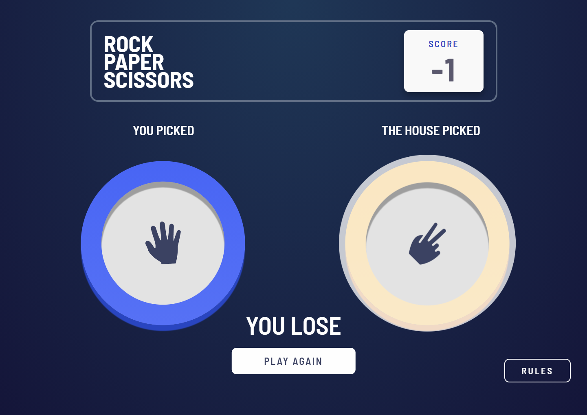
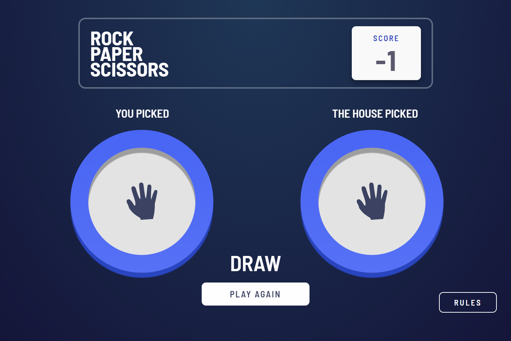
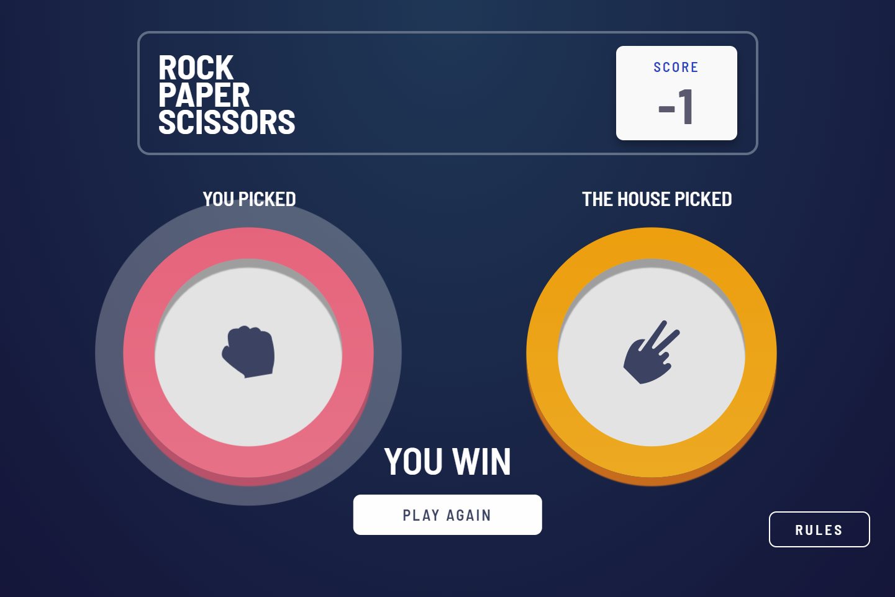

# Frontend Mentor - Rock, Paper, Scissors Game
  

### The challenge

Users should be able to:

- View the optimal layout for the game depending on their device's screen size
- Play Rock, Paper, Scissors against the computer

### Screenshot

Computer view

Mobile view

Lose

Draw

Win

### Built with

- HTML5
- CSS
- Javascript
- Flexbox

### What I learned

I added a lot of animations to make it look smooth.
I really like it and it was really fun to make.
The "difficult" part was to reload every element on the page when you want to play again.